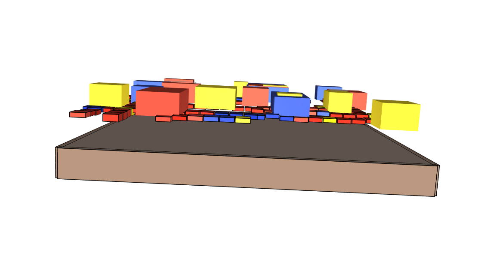
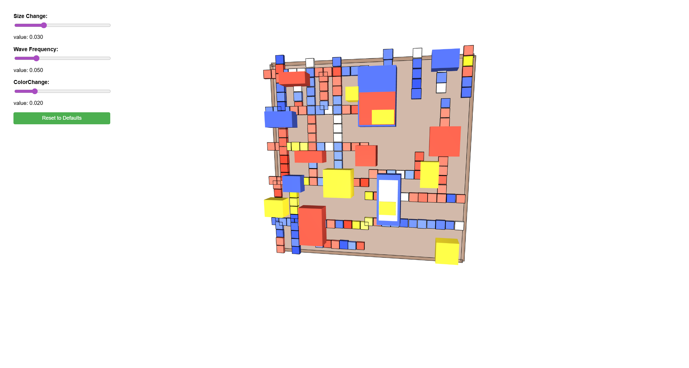
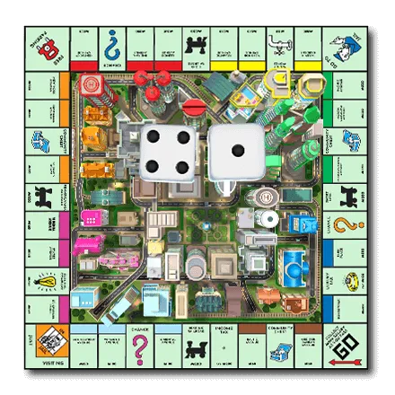
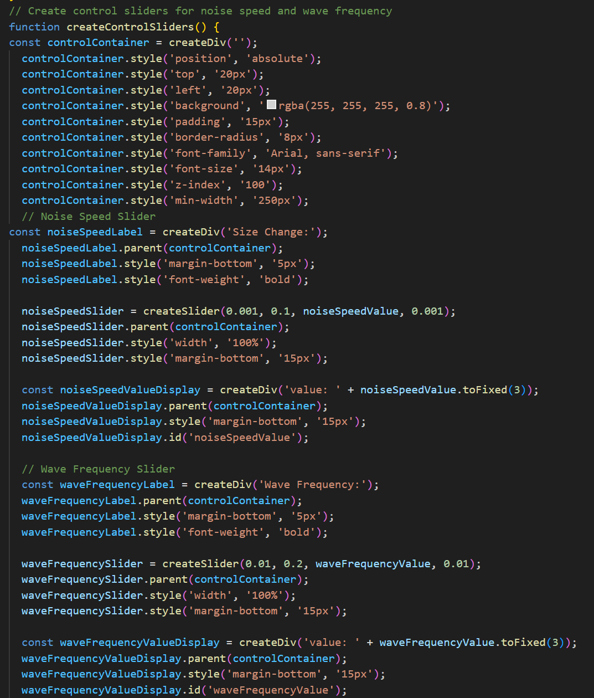
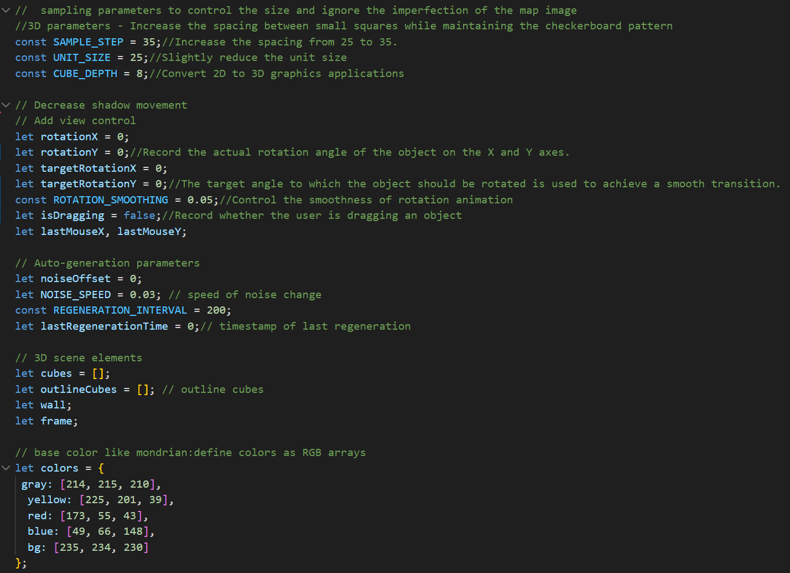
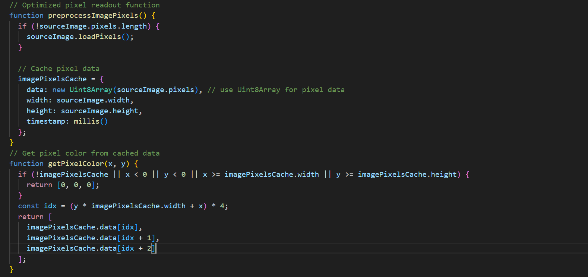

<H1>Main-project_Individual</H1>
<H2>How to Interact with the Project</H2>

After the page loads, Mondrian's painting continuously changes. I believe our theme, the city, is precisely a constantly evolving subject. The screen displays 3D columns and small cubes that form Mondrian's work. The large cubes use a Berlin noise function to control the wave and size changes, while the small cubes use Berlin noise to control the speed of color changes, wave changes, and size changes. The sliders in the lower left corner control their movement speed, size, color (range: 0.1 to 0.001), and wave (range: 0.01 to 0.2). Clicking the "Reset" button returns the speed to the initial settings. The mouse can also be used to control the perspective. I've integrated this with the art of deconstruction and reconstruction, making the entire painting appear to float above the frame, thus creating a unique way of presenting the artwork.

<H2>My Personal Animation Design Methodology</H2>

Based on the team's foundational code, I designed a 3D city concept, allowing the canvas to present a 3D view with prominent frames, while simultaneously making the artwork appear to come alive and constantly change. The canvas utilizes multiple Burmester noise techniques to allow the elements of the artwork to produce different variations. Through the characteristics of Burmester noise, I enabled rich movement in the artwork, and the mouse cursor allows users to experience the artwork from different perspectives. During the production process, it was impossible to perfectly cut the boundaries as in 2D, so I made multiple adjustments to ensure that each large cube could be seamlessly integrated and blended together.

<H2>Code Techniques</H2>

I chose the role of Berlin noise in different elements as the core of the work. This allows the painting to change randomly without losing its aesthetic appeal, while respecting Mondrian's original work and retaining some of its characteristics: the Berlin noise presents a natural and fluid transformation, and through 3D presentation and the changes in the Berlin noise, even without changing the perspective, one can feel that the changes in the animation are not only in color but also in many other elements. Changing the perspective reveals the movement of the Berlin noise, thus experiencing how the painting changes from different viewpoints. The painting is transformed into a 3D style using cubes and columns. Through different dimensions, Mondrian's artwork is reinterpreted. When we view paintings, we often overlook their core and soul. Through this method, I believe that while interacting with the painting, we are also being reshaped by it, reshaping our impression of the original artwork.

<H2>Inspiration</H2>

(map from Monopoly mobile game)

The main source of inspiration is Mondrian's "Broadway Boogie-Woogie". I wanted to simulate a "marquee", like the ever-changing neon lights in a city. I drew inspiration from Monopoly's original paper maps to its current mobile games and generative art, striving to create a feeling of "city marquee" and "terrain changes" by converting 2D to 3D.

This control panel allows users to: adjust the "breathing" effect (size change) of the 3D blocks, control the overall wave motion rhythm, adjust the speed and frequency of color changes, create personalized dynamic art experiences, and instantly adjust and explore the dynamic expression of 3D artworks.

This code implements 2D to 3D conversion: transforming a flat road image into 3D art; adding user interaction: providing smooth mouse control and perspective changes; dynamic aesthetics: creating continuously changing colors and wave effects; performance optimization: balancing visual effects with operational efficiency; and artistic style: maintaining the geometric and color characteristics of Mondrian style.

Convert 2D coordinates to 1D array indexes.
Extract RGB color values ​​from the pixel array.
Provide data for subsequent image analysis and 3D conversion.
This is the foundation of the entire 3D art generation process, determining which pixels will be converted into 3D cubes.

<H2>Modifications to the Group Code</H2>

This system introduces significant enhancements, including a new WEBGL 3D rendering environment that replaces 2D blocks with a dynamic 3D cube generation system, complemented by intuitive mouse drag-and-drop view controls and a real-time parameter control panel. Performance has been optimized through an image pixel caching system that reduces frequent read operations, an improved checkerboard sampling mode for enhanced rendering efficiency, and automated regeneration interval control. The interactive experience has been elevated with three real-time control sliders for size changes, wave frequency, and color speed adjustments, along with reset button functionality and smoother camera movement for more fluid navigation.

<H2>external Tools or Resources Used</H2>

This system is built upon p5.js's official documentation for WEBGL 3D rendering, camera control, and geometric drawing techniques, combined with the application of Perlin noise from the generative art community, and incorporates Mondrian's composition principles and color theory. In terms of technical choices, Perlin noise is used to create organic hand-drawn effects, multi-layer rendering mimics the texture of real painting, real-time parameter control allows users to participate in the creative process, while performance optimization ensures smooth operation. The innovation lies in combining the classic Mondrian style with modern generative art, creating an interactive 3D art experience, and achieving intelligent conversion from 2D images to 3D scenes. It successfully integrates algorithmic art, traditional painting principles, and modern interactive technology to form a unique digital art experience.
<H2>Use of unit8Array </H2>

Uint8Array originates from JavaScript's TypedArray specification(https://developer.mozilla.org/en-US/docs/Web/JavaScript/Reference/Global_Objects/TypedArray) and is part of the ECMAScript 6 standard, specifically designed for handling binary data. In p5.js image processing, when loadPixels() is called, the image data is stored in the pixels property in the form of Uint8Array. Its technical advantages include reducing system calls, enabling fast random access to pixel data, ensuring type safety by keeping all values within the 0-255 range, and benefiting from modern browsers' specialized optimization for TypedArray. This technical choice is particularly suitable for real-time graphics applications that require frequent reading of image pixels, such as real-time image processing, computer vision algorithms, generative art systems, and 3D texture processing, significantly enhancing the performance and responsiveness of 3D art generators.
